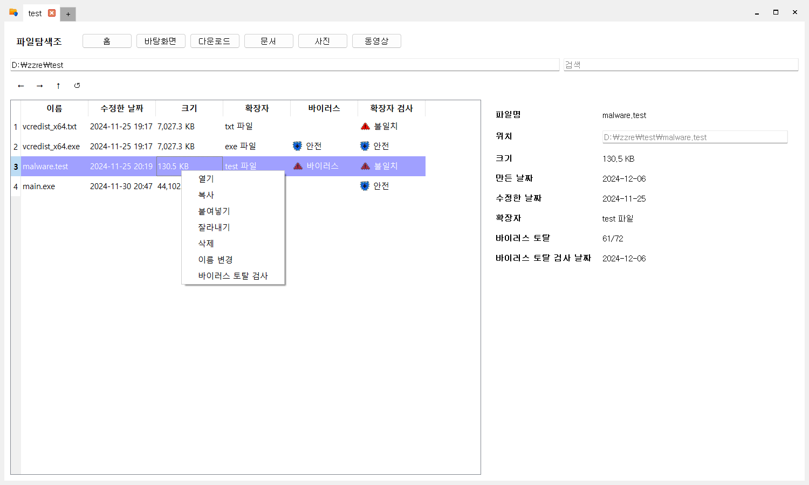

# AICS306-FileExplorer

시스템보안 3조 파일탐색기



## Prerequisites

- [Git](https://git-scm.com/) - For cloning repository / git bash
- [Python](https://www.python.org/downloads/) - preferably  Python 3.12
- [Chocolatey](https://chocolatey.org/) - Windows package manager
- [Make](https://www.gnu.org/software/make/) - build automation tool

## Build

### 1. Clone the repository

```powershell
git clone "https://github.com/zzre/AICS306-FileExplorer"
cd "AICS306-FileExplorer"
```

### 2. Install Dependencies

```powershell
python3 -m pip install -r requirements.txt
```

### 3. Build

Execute commands on git bash.

Install make (requires administrator privileges):

```powershell
choco install make
```

Build:
```powershell
make
```
